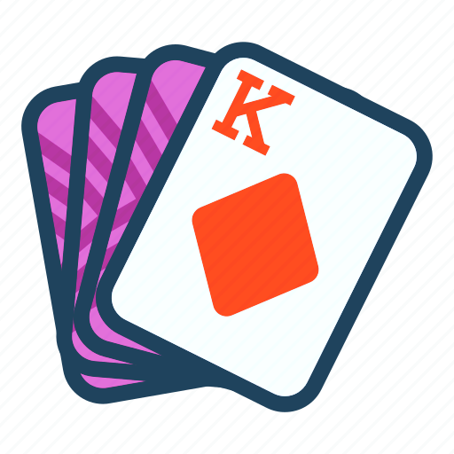

# Deck Language Support

Deck Language Support is a Visual Studio Code extension that provides language support for the deck language. It provides syntax highlighting, snippets, and language server features for `.deck` files which is the input format for PIC laser plasma simulation package [EPOCH](https://github.com/Warwick-Plasma/epoch).

## Features

- Syntax Highlighting
- Snippets
- Autocompletion
- Hover Information
- Linting
- Go to Definition and References 
- Block Folding

## Installation

This extension is available for free in the [Visual Studio Code Marketplace](https://marketplace.visualstudio.com/)

## Configuration

This extension contributes the following settings:

- `languageServerExample.maxNumberOfProblems`: Controls the maximum number of problems produced by the server.
- `languageServerExample.trace.server`: Traces the communication between VS Code and the language server.

## Contributing

If you are interested in making this extension better, please feel free to contribute. Contributions are highly appreciated!

Visit the project on [GitHub](https://github.com/Wang-Zhongwei/deck-language-support).

## License

This extension is licensed under the MIT License, please see the [License file](LICENSE.md) for more information.
